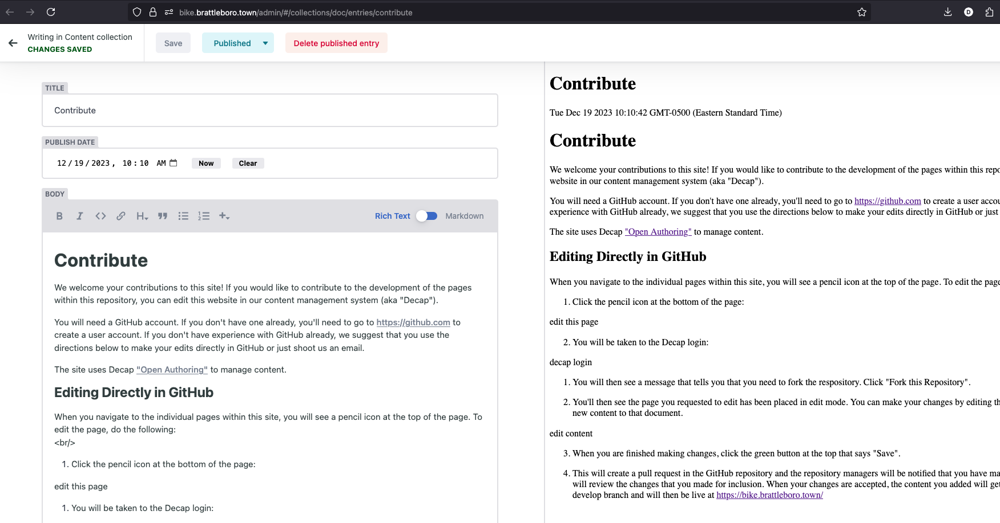

# Contribute

We welcome your contributions to this site! If you would like to contribute to the development of the pages within this repository, you can edit this website in our content management system (aka "Decap").

You will need a GitHub account. If you don't have one already, you'll need to go to <https://github.com> to create a user account. If you don't have experience with GitHub already, we suggest that you use the directions below to make your edits directly in GitHub or just shoot us an email.

The site uses Decap ["Open Authoring"](https://decapcms.org/docs/open-authoring/) to manage content.

## Editing Directly in GitHub

When you navigate to the individual pages within this site, you will see a pencil icon at the top of the page. To edit the page, do the following:
 

1. Click the pencil icon at the bottom of the page:

2. You will be taken to the Decap login:

1. You will then see a message that tells you that you need to fork the respository. Click "Fork this Repository".

2. You'll then see the page you requested to edit has been placed in edit mode. You can make your changes by editing the content or adding new content to that document.

3. When you are finished making changes, click the green button at the top that says "Save".

4. This will create a pull request in the GitHub repository and the repository managers will be notified that you have made changes. Someone will review the changes that you made for inclusion. When your changes are accepted, the content you added will get merged with our develop branch and will then be live at [https://bike.brattleboro.town/](https://bike.brattleboro.town/)
